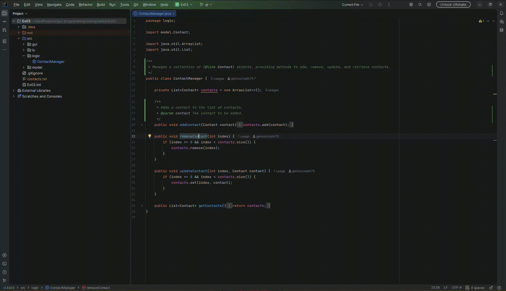

# DocuMate

An IntelliJ IDEA plugin that generates **KDoc / Javadoc documentation** for Kotlin and Java functions and classes using
the [Google Gemini API](https://gemini.google.com/app/).

## Features

- One shortcut (`Ctrl+Shift+D`) or right-click → **Generate AI Documentation**
- Works on Kotlin functions, classes, objects and Java methods, classes
- Generated comment is inserted directly above the element, indentation-aware
- API key stored securely in the OS keychain via IntelliJ `PasswordSafe` - never written to disk in plaintext

## Usage

1. Open a Kotlin or Java file
2. Place the caret inside any function or class
3. Press `Ctrl+Shift+D` (or `Cmd+Shift+D` on macOS), or right-click → **Generate AI Documentation**
4. The generated KDoc/Javadoc comment appears above the element

## Demo



## Setup

### Prerequisites

- IntelliJ IDEA 2024.1+
- JDK 21
- [Gemini API key](https://aistudio.google.com/)

### Configure the API Key

Go to **Settings → Tools → DocuMate** and paste your Anthropic API key.  
Use the **Test Connection** button to verify it works.

### Build & Run Locally

```bash
./gradlew runIde
```

### Build Plugin Artifact

```bash
./gradlew buildPlugin
# output: build/distributions/DocuMate-1.0.0.zip
```

## Project Structure

```
src/main/kotlin/com/documate/
├── actions/
│   └── GenerateDocAction.kt      # AnAction – entry point, orchestrates the flow
├── api/
│   └── GeminiClient.kt           # HTTP client for Gemini API
├── psi/
│   └── PsiHelper.kt              # PSI tree traversal to find target element
├── inserter/
│   └── DocumentationInserter.kt  # Writes the comment into the document
└── settings/
    ├── DocuMateSettings.kt       # Credential storage via PasswordSafe
    └── DocuMateConfigurable.kt   # Settings UI panel
```

## Security Notes

- The API key is stored in the OS keychain via IntelliJ `PasswordSafe`
- The key is sent only in the `x-goog-api-key` HTTP header - never logged or written to files
- Source code sent to the API is truncated at 4000 characters
- Raw API error responses are not surfaced to avoid leaking internal details

## Tech Stack

- **Language:** Kotlin
- **Platform:** IntelliJ Platform SDK (Gradle IntelliJ Plugin v2)
- **AI:** Google Gemini API (`gemini-2.5-flash`)
- **HTTP:** `java.net.http.HttpClient` (JDK built-in, no extra dependency)
- **JSON:** Gson
